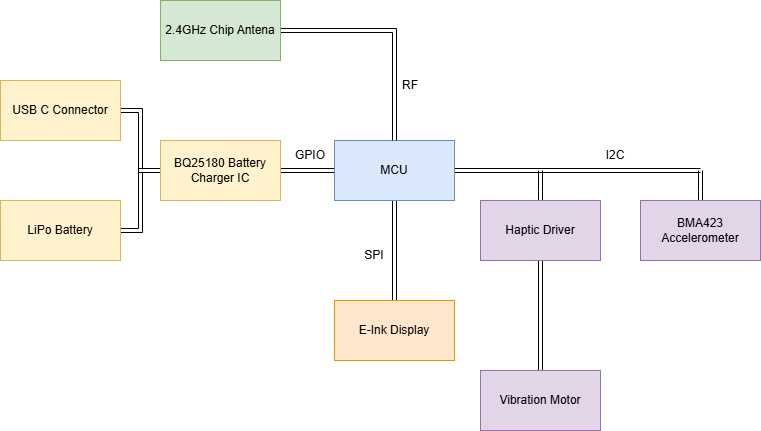
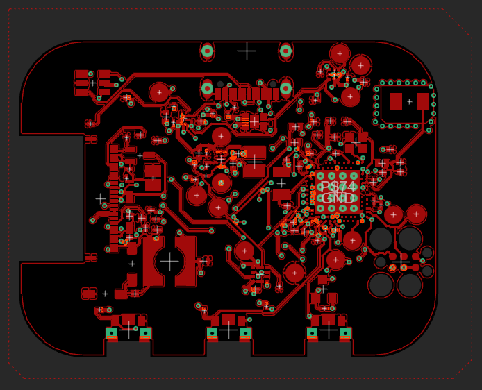
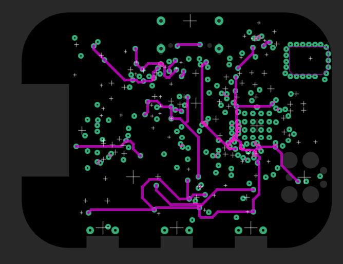
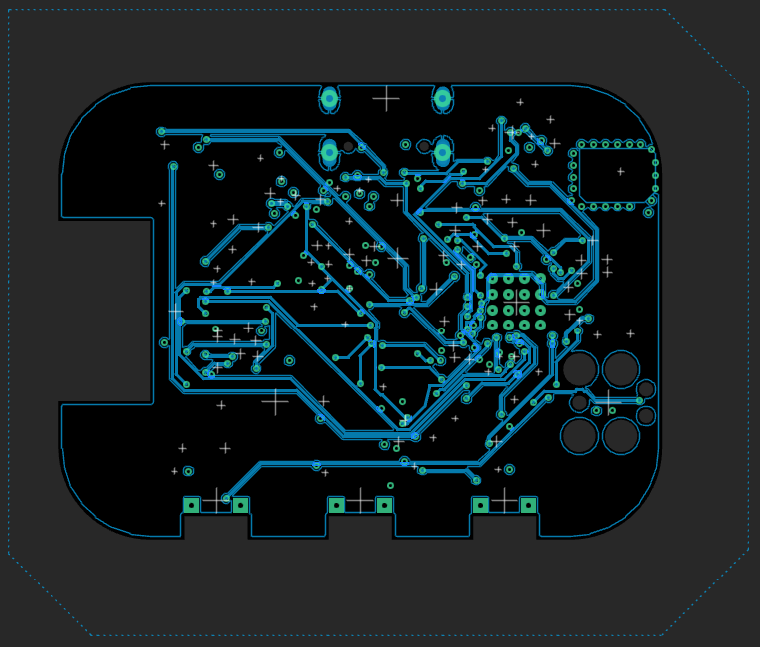

# Proiect InkTime - E-Paper Smartwatch (nRF52840)

## Descriere Generală
InkTime este un prototip hardware de smartwatch (dispozitiv wearable) proiectat de la zero, cu un focus absolut pe eficiența energetică (Ultra-Low Power) și miniaturizare. 
Creierul sistemului este SoC-ul **Nordic nRF52840**, capabil de conectivitate Bluetooth 5.0 LE. Dispozitivul interacționează cu utilizatorul printr-un ecran E-Paper de 3.3V (tehnologie bistabilă), butoane tactile și feedback haptic (motor liniar/ERM), fiind capabil să monitorizeze activitatea fizică prin intermediul unui accelerometru integrat.

---

## 1. Diagramă Bloc

Arhitectura hardware este centrată în jurul microcontrolerului, care acționează ca un Master I2C/SPI pentru toate perifericele, permițând controlul granular al stărilor de alimentare pentru fiecare modul în parte.

---

## 2. Bill of Materials (BOM) - Componente Principale

Pentru producția și asamblarea PCB-ului (PCBA), componentele au fost selectate pe baza disponibilității la producătorul JLCPCB (LCSC Parts) și a footprint-ului redus (QFN, BGA sau 0402/0201 pentru pasive).

| Componentă (Designator) | Rol în Sistem | Producător | Datasheet | Link JLCPCB |
| :--- | :--- | :--- | :--- | :--- |
| **nRF52840-QIAA** (U1) | Microcontroller & BLE Radio | Nordic Semi | [Datasheet](https://infocenter.nordicsemi.com/pdf/nRF52840_PS_v1.7.pdf) | [C145322](https://jlcpcb.com/partdetail/NordicSemicon-nRF52840QIAAR/C145322) |
| **BQ25180YBGR** (IC1) | LiPo Battery Charger | Texas Instruments | [Datasheet](https://www.ti.com/lit/ds/symlink/bq25180.pdf) | [C3166611](https://jlcpcb.com/partdetail/TexasInstruments-BQ25180YBGR/C3166611) |
| **MAX17048G+T10** (U3) | Fuel Gauge (Monitor Baterie) | Analog Devices | [Datasheet](https://www.analog.com/media/en/technical-documentation/data-sheets/MAX17048-MAX17049.pdf) | [C82806](https://jlcpcb.com/partdetail/Maxim_Integrated-MAX17048GT10/C82806) |
| **RT6160AWSC** (IC9) | DC/DC Buck-Boost Converter | Richtek | [Datasheet](https://www.richtek.com/assets/product_file/RT6160A/DS6160A-02.pdf) | [C2834316](https://jlcpcb.com/parts) |
| **BMA423 / BMA421** (IC3) | Accelerometru Triaxial (IMU) | Bosch Sensortec | [Datasheet](https://www.bosch-sensortec.com/media/boschsensortec/downloads/datasheets/bst-bma423-ds004.pdf) | [C283838](https://jlcpcb.com/partdetail/BoschSensortec-BMA423/C283838) |
| **DRV2605YZFR** (IC2) | Haptic Driver (LRA/ERM) | Texas Instruments | [Datasheet](https://www.ti.com/lit/ds/symlink/drv2605.pdf) | [C74431](https://jlcpcb.com/partdetail/TexasInstruments-DRV2605YZFR/C74431) |
| **2450AT18B100E** (ANT1)| Antenă Ceramică 2.4 GHz | Johanson Tech | [Datasheet](https://www.johansontechnology.com/datasheets/2450AT18B100/2450AT18B100.pdf) | [C210086](https://jlcpcb.com/partdetail/JohansonTechnology-2450AT18B100E/C210086) |

*(Notă: Componentele pasive - rezistențe și condensatori de 0201/0402, inductoarele de putere și conectorii USB-C/FPC se regăsesc detaliate în fișierul `BOM.csv` din folderul Manufacturing).*

---

## 3. Funcționalitate Hardware Detaliată

Sistemul a fost împărțit în mai multe subsisteme, optimizate pentru a permite oprirea alimentării (Power Gating) atunci când nu sunt utilizate.

### 3.1. Procesare și Radio (nRF52840)
MCU-ul rulează la o tensiune stabilizată de 3.3V. Pentru a menține timing-ul BLE și RTC-ul (Real Time Clock) cu un consum de doar ~1.5µA, a fost integrat un cristal extern de 32.768 kHz (`X2`). Conexiunea radio se face printr-o rețea Pi-Matching către antena ceramică de 2.4GHz.

### 3.2. Magistrala I2C și Senzorii
Toate perifericele de monitorizare și input folosesc o magistrală comună **I2C** (Fast Mode - 400kHz), echipată cu rezistențe de pull-up de 10kΩ.
* **BMA423 (IMU - 0x18):** Configurabil să ruleze algoritmul de *step-counting* intern. Nu ține MCU-ul treaz; trimite un semnal pe pinul `IMU_INT1` doar când detectează pași sau gesturi (Tilt-to-Wake).
* **MAX17048 (Fuel Gauge - 0x36):** Estimează starea bateriei (State of Charge) fără a necesita o rezistență de șunt (care ar irosi energie), folosind algoritmul ModelGauge. Poate genera o alertă hardware (`ALERT`) când bateria scade sub un prag definit.
* **BQ25180 (Charger - 0x6A):** Negociază curentul de încărcare tras din portul USB-C (limitat software la 100mA - 300mA pentru a proteja celula LiPo mică).
* **DRV2605 (Haptic - 0x5A):** Conține o bibliotecă internă de forme de undă pentru vibrații. Este ținut în shutdown (consum <1µA) și activat doar la notificări prin pinul `HAPTIC_EN`.

### 3.3. Display-ul E-Paper (SPI)
Interfața vizuală folosește un panou bistabil conectat printr-un cablu FPC 24-pin.
* **Comunicația:** Se face via **SPI 4-wire** (doar TX/MOSI, deoarece ecranul nu trimite date înapoi, ci folosește un pin dedicat `EPD_BUSY` pentru a semnaliza starea).
* **Boost Circuit:** Deoarece cerneala electronică necesită tensiuni mari (VGH, VGL, +/- 15V) pentru a muta pigmenții, placa include circuitul de switching cu inductor de 68uH și diode Schottky MBR0530. Acest circuit este pornit exclusiv în secunda în care ecranul își dă refresh.

### 3.4. Calcule de Consum de Energie (Power Budget)
Eficiența proiectului se bazează pe regimul de funcționare *Duty-Cycled*. Estimarea autonomiei cu o baterie LiPo de **150 mAh**:

1. **Modul Deep Sleep (98% din timp):**
   * nRF52840 (System ON, RTC): ~1.5 µA
   * BMA423 (Low-power sensing): ~4 µA
   * BQ25180 + RT6160 (Quiescent): ~8 µA
   * Fuel Gauge (Hibernate): ~3 µA
   * Ecran E-Paper: 0 µA
   * **Total Sleep:** **~16.5 µA**

2. **Modul Activ (Evenimente periodice):**
   * Refresh Ecran (1 dată pe minut): ~8 mA timp de 1s.
   * Transmisie BLE: ~5 mA timp de 10ms.
   * **Consum Mediu Echivalent:** **~1.2 mA / oră** (incluzând spike-urile de refresh).

3. **Autonomie Teoretică:** `150 mAh / 1.2 mA ≈ 125 de ore (aprox. 5 zile)` de utilizare normală, cu potențial de extindere până la **săptămâni** dacă ecranul este actualizat doar la cerere (button press).

---

## 4. Alocarea Pinilor nRF52840 și Justificare

Rutarea pinilor (Pin Muxing) a fost aleasă strategic pentru a evita încrucișările pe PCB și pentru a grupa interfețele de mare viteză.

| Pin MCU | Funcție Atribuită | Tip Interfață | Justificarea Alegerii (Hardware Design) |
| :--- | :--- | :--- | :--- |
| **P0.00 / P0.01** | `XL1` / `XL2` | Analog | Pini dedicați hardware exclusiv pentru cristalul LFXO (32.768kHz). |
| **P0.06 / P0.07** | `SDA` / `SCL` | I2C (TWIM) | Plasați convenabil pe latura de jos a IC-ului, rutare directă spre grupul de senzori (Bottom). |
| **P0.08 / P1.08** | `IMU_INT1` / `IMU_INT2`| GPIO (Interrupt) | Intrări cu capacitate de *Wake-up*, conectate direct la accelerometru. |
| **P0.02 / P0.03** | `SCK` / `MOSI` | SPI (SPIM) | Alocați pentru a minimiza distanța fizică a traseelor de mare viteză către conectorul FPC al ecranului (partea dreaptă a plăcii). |
| **P0.17** | `EPD_BUSY` | GPIO (Input) | Citește flag-ul de busy de la ecran. Permite MCU-ului să doarmă între comenzile SPI. |
| **P1.06** | `HAPTIC_EN` | GPIO (Output) | Semnal digital simplu (Enable) pentru a tăia alimentarea driverului de vibrații. |
| **P1.01 / P1.02 / P1.03** | `SW_UP/DN/ENT` | GPIO (Input) | Pini configurați cu rezistențe de pull-up interne/externe pentru debounce-ul mecanic al butoanelor. |
| **SWDIO / SWDCLK** | Debug / Flash | SWD | Pini hardwired pentru programarea via conectorul TC2030-IDC. |

---

## 5. Design Log & PCB Layout (4-Layer Stackup)

PCB-ul a fost proiectat pe 4 straturi pentru a asigura plane solide de referință (GND), necesare disipării termice și integrității semnalului RF. 
S-a implementat o matrice de **Via Stitching** în jurul secțiunii de radiofrecvență și un decupaj (Polygon Cutout) pe toate cele 4 straturi sub antena Johanson, pentru a preveni atenuarea undelor electromagnetice.

* **Layer 1 (Top):** Găzduiește toate componentele SMD, planul de masă (GND) primar și traseele critice de scurtă distanță.

* **Layer 2 (Route2 / Inner GND):** Strat intern dedicat exclusiv unui plan de masă continuu (Solid Ground Plane). Acesta oferă o cale de întoarcere curată și scurtă pentru curenți, esențială pentru ecranarea zgomotului (EMI) și performanța antenei.

* **Layer 3 (Route63 / Inner Power):** Strat intern dedicat rețelelor de distribuție a puterii (`3V3`, `VBUS`, `VBAT`, `VREG`). Traseele au o lățime minimă de 0.3mm pentru a menține o impedanță redusă și a preveni căderile de tensiune la solicitări tranzitorii.

* **Layer 4 (Bottom):** Utilizat preponderent pentru rutarea magistralelor de date (ex: `I2C`) și pentru realizarea conexiunilor lungi care ar fi aglomerat fața Top. Dispune, de asemenea, de propriul plan de masă auxiliar.

### Testabilitate și Producție
Placa dispune de **Test Pad-uri** dedicate pentru toate semnalele critice (`3V3`, `VBAT`, `SDA`, `SCL`, `SWDIO`), etichetate clar pe layer-ul de Silkscreen, permițând depanarea facilă cu osciloscopul sau analizorul logic după asamblare.
### Testabilitate și Producție
Placa dispune de **Test Pad-uri** dedicate pentru toate semnalele critice (`3V3`, `VBAT`, `SDA`, `SCL`, `SWDIO`), etichetate clar pe layer-ul de Silkscreen, permițând depanarea facilă cu osciloscopul sau analizorul logic după asamblare.
